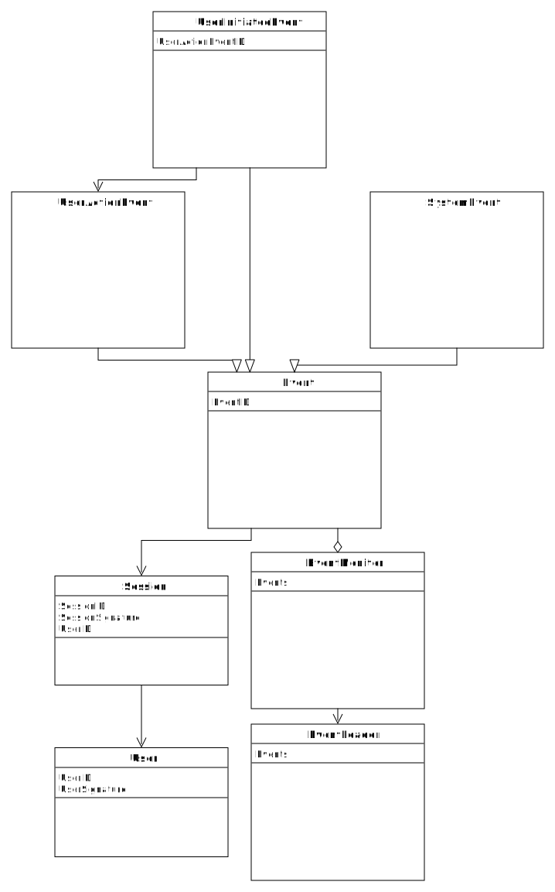

#Event Monitoring

Event monitor should gather information about important events in a system, store this information, and send it to a
centralized data collection service.

##Events

Event is anything worth noticing that happens within a system. Monitored events are events that are tracked 
by an event monitor.

##Monitoring Goals

The main goals of event monitoring are:
* Gather information about user actions to better understand user needs.
* Gather performance data to identify possible bottlenecks and improve overall app performance.
* Identify possible issues within an application and use this data to improve code quality.

##Implementation Goals

Major design goals are:
* Gather as much information as required to fulfill monitoring goals.
* Store information in such a way that it can be analyzed easily.
* Minimize an amount of space stored information would occupy.
* Minimize number of network requests and amount of information transferred over the network.

##Monitored Events

The following event types can be monitored:
* User actions: actions that user initiates using an application UI.
* User-initiated events: events that are results of user action. For example, if a user requested information 
about a particular word, it may result to one or several requests to external servers and may trigger 
one or several data processing routines. Each of those would be an event initiated by a user action
as described above.
* System events: events that happens in a system and are not associated with any user actions. 
This could include periodic background checks, data cleanups, and so on.

Separating events into different groups would allow to analyze them separately: user actions only (what users do), 
user-initiated events (how long does it take to process a user request and what bottlenecks might there be), 
system events (how do system background processes behave).

##Performance Limitations

Event collection should provide the best performance possible. The major performance concerns are:
* Amount of data stored. Stored data could potentially take a significant amount of space.
* Networking performance. Networking performance could be a limiting factor for users with slow connections,
especially for users with mobile devices.

## Events Architecture

### Events Class Diagram

### Event, UserActionEvent, UserInitiatedEvent, and SystemEvent

Event represents a generic event that happens in a system. It has three subclasses: UserActionEvent (an action that
was initiated by a user using UI controls), UserInitiatedEvent (an event that is a result of a user action), and
a SystemEvent, an event that happens in a background. UserInitiatedEvent has a UserActionEvent ID that is 
a reference to the UserAction object. This allows to monitor what user action initiated this event.

### User and Session 

User class represents a unique user of an application. Session is a finite period of user activity within a system.
Session contains user information, as each session could have only one user.

### EventMonitor

EventMonitor is an in-memory database that stores event objects as they happen within a system. After a certain
time interval, or when a number of events threshold is reached, it sends a portion of events to the EventLoader.
Those events are then purged from an EventMonitor database.

EventMonitor exists within a content script space. There is one event monitor per page where Alhpeios extension
is activated.

### EventLogger

EventLogger is responsible for a permanent storage of events. It exists within a background page of an extension
and is running all the time when an extension is activated. It can use IndexedDB to store events and 
will send a batch of events to the centralized event collection serer periodically once a certain 
event or duration threshold is reached.

##Event Recording

It is probably better to keep an event monitoring logic separate from an object that provide business logic functions.
This has several advantages:
* Separation of concerns: business logic does need to know nothing about how logging is made.
* Less interdependency: business logic and monitoring logic can be changed more easily (although monitoring
logic would depend on signature of business logic functions).
* Better testing: business and monitoring logic can be tested separately.

Such separation can be achieved by utilizing wrapper monitoring objects. Each business class whose actions needs
to be monitored must have a monitoring subclass. A monitoring subclass reimplements those methods of a parent
that need to be monitored. Monitoring subclass' methods record events data and then call corresponding
methods of their business superclass.

An approach like this would work very well with synchronous functions. Asynchronous functions would probably 
require some special architecture, probably a division into smaller synchronous methods that can 
be recorded separately.

##Implementation Details

###User IDs
Each user should ideally be represented by one User object with a unique user ID. With such user ID it would
be very easy to trace all user activity through time. Such IDs should probably be generated in some centralized
place, such as centralized data server, as only this server would own the knowledge of all users across all
app instances.

However, getting a user ID from a centralized server would take a network request. To avoid it, we can generate
a temporary user ID for each user session on a client side. We will also record a "user signature" - a string
or an object that will identify a user uniquely (i.e. record a user fingerprint). When events are sent 
to the centralized server, they are accompanied with user signature information. If a centralized server 
discovers that it already has a user with this particular signature it its database, it will replace a 
temporary user ID within a batch of events it received with the user ID it has for this user
in its database. Even though more complex, such approach would cut the number of network requests 
and will allow to record user actions even when a centralized serer is not available 
(i.e. if there is no Internet connection).

###Data Structure
We should probably store user and session objects separately from events itself. Events can store session IDs
as references to session objects, and session objects can store a reference to the user object.

There can be multiple events that will share the same session data. Storing just a reference to the
session object will allow to significantly reduce an amount of space each event would take.

## Questions for Discussion

### How to uniquely identify a user?
How do we identify a same user across multiple devices?

